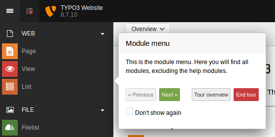
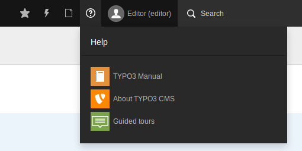

# Guided tours for TYPO3

The guided tour extension ([EXT:guide](https://typo3.org/extensions/repository/view/guide)) for TYPO3 provides you the ability for creating guided tours through the TYPO3 backend. These
tours should give editors an introduction of different areas and features, so that he easily finds out how to use TYPO3.

Developers of third party extensions have the ability to provide own guided tours for their backend modules.

All tours may be modified via TSconfig, to support different use cases for different backend groups.



## Backend module

The guided tour extension comes with an own backend module, which you will find in the *help menu* in the *topbar* of
the TYPO3 backend. It will list you all (for your current user accessible) guided tours. You're able to start each tour
or resume tours which you have started once. Additionally you're able to reactivate tours, that you had marked as *Don't 
show again*.



## Add a new tour

A new tour should be registered within an extension. It is also possible to create tours with pure TSconfig only,
but discouraged, since parsing the TSconfig files is slow and not as flexible.

Register a tour in the `ext_localconf.php` file in your extension:
 
```php
\Tx\Guide\Utility\GuideUtility::addTour(
	'MyExtensionModuleTour',
	'LLL:EXT:myextension/Resources/Private/Language/MyExtensionModuleTour.xlf:title',
	'LLL:EXT:myextension/Resources/Private/Language/MyExtensionModuleTour.xlf:description',
	'web_list',
	'module-web_list',
	'EXT:myextension/Configuration/Tours/'
);
```

The `\Tx\Guide\Utility\GuideUtility::addTour` method requires the following parameters:

1. The tour identifier. Should be a upper-camel-cased string, and unique (eg. prepend extension name). The YAML-file needs to have the same name.
1. The title for the tour. This can be a localization identifier too.
1. The description for the tour. This can be a localization identifier too.
1. The module-key of the tour. This is the starting point of the tour, the guide extension will open this module when starting.
1. The icon identifier for the tour. See [TYPO3.Icons](https://github.com/TYPO3/TYPO3.Icons) for available icons or how to register your own.
1. The base path for your *.yaml configuration files for the tour. 

Now create a YAML-file. For the example given above, it needs to be stored at 
`EXT:myextension/Configuration/Tours/MyExtensionModuleTour.yaml`.

*Note:* All settings in the YAML may be modified with overwrites in the 
Page-TSconfig or User-TSconfig again.

## Modify existing tours 

All registered tours are stored below the node `mod.guide.tours`. 

To add a tour with TSconfig only, you could use the following example as well:

```
mod.guide.tours.MySpecialModuleTour {
	# here comes your guided tour configuration
}
```

To modify an existing tour, you therefore just need to add option values below the tour identifier.

The guide extension provides some example tours. If you want the second popover 
of the *ViewModule* tour append on the *right* instead of the *bottom*, you would 
insert the following configuration into your TSconfig:

```
mod.guide.tours.ViewModule {
	steps.20.placement = right
}
```

*Note:* The User-TSconfig is always applied, either in a user or a user group. 
Due to technical reasons the Page-TSconfig is read from page 0 (`root`) only!
Page-TSconfig stored on any other page wont be recognized by the module.

To add TSconfig to the root page you need to register a file in the 
`ext_localconf.php` file in your extension:

```php
\TYPO3\CMS\Core\Utility\ExtensionManagementUtility::addPageTSConfig(
	'<INCLUDE_TYPOSCRIPT: source="FILE:EXT:' . $_EXTKEY . '/Configuration/TSconfig/MyGuidedTour.pagets">'
);
```

## Configuration

### Tour

As explained before, the configuration should be done in YAML, but may be 
modified in TSconfig. The following description is done for TSconfig, but the 
options are the same as in your YAML file.

Each *tour* node can be configured like this:

```
mod.guide.tours.ViewModule {
	# The title of the tour. This title will be displayed in the backend module.
	# Enter simply some text or use a LLL identifier.
	title = LLL:EXT:myextension/Resources/Private/Language/MyExtensionModuleTour.xlf:guide_tour.title

	# Description of the tour. This description will be displayed in the backend module.
	# Enter simply some text or use a LLL identifier.
	description = LLL:EXT:myextension/Resources/Private/Language/MyExtensionModuleTour.xlf:guide_tour.description

	# The module key is the starting point of the tour. 
	# The guide extensions opens the given module when starting a tour. To switch
	# beetween modules just register another tour.
	# This is the same name like the `M` parameter in backend links.
	# Special value: `core` is used for tours which are executed in the top frame.
	# Example values:
	# - Page module: web_layout (a tour which is executed in page module)
	# - View module: web_ViewpageView (a tour which is executed in view module)
	# - Backend: core (a tour which is executed in the top frame of the backend window)
	moduleName = core

	# Icon identifier for the icon in backend module.
	# See https://github.com/TYPO3/TYPO3.Icons for available icons or how to register your own.
	iconIdentifier = module-guide-tour-core
	# In the steps node you have insert a node for each popover you want to display.
	steps {
		# The key of the steps should be numeric and defines the order of displaying the popover
		10 {
			# ...
		}
		20 {
			# ...
		}
		# A step key can also be defined by a key name. 
		# This can be useful, if you like to jump to this step without knowing his step number.
		step-key-by-key-name {
			# ...
		}
	}
	# Steps configuration can have a path to a YAML file with the step configuration. This field is optional.
	# By setting your step configuration with this path, you're able to provide conditional steps depending on TYPO3 
	# Major version. Additionally the steps are dynanical reloaded and the Page-TypoScript (tsconfig) remains small.
	stepsConfiguration = EXT:guide/Configuration/Tours/
```

### Steps

Each *step* node can be configured like this:

```
	# The selector is passed to jQuery for selecting the HTML-Element, on which the popover should be placed.
	# This selector must be unique in DOM. A selector can also be a unique data attribute/value.
	# Examples:
	# selector = #some-id
	# selector = .some-unique-class
	# selector = .some-multiple-used-class:first
	# selector = select[name=\'WebFuncJumpMenu\']:first
	# selector = [data-identifier='apps-toolbar-menu-shortcut']
	selector = .typo3-aboutmodules-inner-docbody
	# This is the title of the popover.
	# Enter simply some text or a LLL identifier like:
	# title = LLL:EXT:guide/Resources/Private/Language/BootstrapTourPageModule.xlf:tx_guide_tour.0.title
	title = Welcome to TYPO3 backend
	# This is the content of the popover.
	# Enter simply some text or a LLL identifier like:
	# title = LLL:EXT:guide/Resources/Private/Language/BootstrapTourPageModule.xlf:tx_guide_tour.0.content
	# You're also be able to use HTML tags like i, u, b, br or p. Additionally there is an img tag for displaying icons, 
	# which must have a data-icon-identifier attribute with the icon identifier. Such an icon usage could look like:
	# 
	# There is a <action> tag, which allows you the define actions for the user, which will be designed noticable.
	# All other tags are disallowed.
	content (
	 This tour will show you the first steps within TYPO3.<br />
	 You're starting here in the  <i>about</i> module, 
	 which shows you your available modules. 
	 This modules are related on the giving user authorisation.<br />
	 <br />
	 Click on <i>Next</i> for an introduction of the topbar of TYPO3.<br />
	 <br />
	 <i>(You can restart each tour by the guided tours module.)</i>
	)
	# Defines the position of the popover.
	# Possible values are: top, bottom, left, right, auto
	placement = top
	# Disables the arrow on popover.
	# The arrow is displayed by default.
	showArrow = false
	# Enables a backdrop.
	# This feature is currently in incubation
	backdrop = false
	# Set a padding for the backdrop
	backdropPadding = 0
	#
	# The following nodes can be used for executing some actions during the tour. 
	#
	# The next node contains actions, which are triggered by clicking the next button
	next {
		# More information below...
	}
	# The show node contains actions, which are triggered by starting to show this step
	show {
		# More information below...
	}
	# The shown node contains actions, which are triggered by finishing to show this step
	shown {
		# More information below...
	}
	# The hide node contains actions, which are triggered by hiding a step
	hide {
		# More information below...
	}
```

#### Next node

The *next* node contains actions, which are triggered by clicking the next button. So you're able to trigger another tour
in the last popover, just by clicking the next button.

```
# By clicking on next, the tour Topbar is triggered
tour = Topbar
# The number/id of the step, which should be displayed of the called tour
step = 0
# StepByKey resolves the step number by the key.
# Internally it runs through the required tour and counts the steps till the defined stepByKey is found. Finally it set
# the counted value into the step-attribute - this means, if you are using stepByKey the step-attribute isn't required.
stepByKey = step-key-by-key-name
```

#### Show node

The *show* node contains actions, which are triggered by starting to show this step. This means in detail, the action is
executed **before** the tour starts the displaying process.
With help of this node you're able to execute actions, like adding or removing a CSS class to an element or open select 
boxes in order to show specific values.

```
# Renames the label of the next button of the popover.
# This is useful, when you're starting another tour by clicking the next button.
renameNextButton = Start next tour
# Add a class on an element. This is useful, when you want to highlight a special element.
addClass {
	# jQuery selector for identifying elements, which should get the class. 
	selector = #typo3-cms-backend-backend-toolbaritems-usertoolbaritem
	# Class to be added
	# Attention: Because of an focus issue, opening a dropdown 
	# by adding the class open is only working with event shown.
	class = open
}
# Removes a class from an element.
removeClass {
	# jQuery selector for identifying elements, which should lose the class
	selector = #typo3-cms-backend-backend-toolbaritems-usertoolbaritem
	# Class to be remove
	class = open
}
# Opens a select box by jQuery selector
openSelectBox {
	selector = select[name=\'WebFuncJumpMenu\']:first
}
```

#### Shown node
The *shown* node contains actions, which are triggered by finishing to show this step. This means in detail, the action is
executed **after** the popover is completely visible. The available actions in this nodes are equal to the *show* node.

#### Hide node
The *hide* node contains actions, which are triggered by hiding a step. The available actions in this nodes are equal to 
the *show* node.

### Create different steps for different Major versions of TYPO3

By providing your step configuration using YAML files, you're able to use different steps for different TYPO3
versions. Just adjust the base folder of your *.yaml files in the registration.

Example base path:

```
EXT:your_ext/Configuration/Tours/
```

Now this base folder needs some sub folders in which the tours for the different TYPO3 versions are stored. Each folder
is simply named by the major version number of TYPO3 - for example:

```
EXT:your_ext
- Configuration
  - Tours
    - TYPO3-7
    - TYPO3-8
    - TYPO3-x
```

In these folders the guide extension searches for YAML files, which have the same name as your tour identifier.
For example, if you're running a TYPO3 LTS 8.7 and you want to define a tour with identifier `AboutModule`, the
guided tours extension would search the steps configuration file in `Configuration/Tours/TYPO3-8/AboutModule.yaml`.
